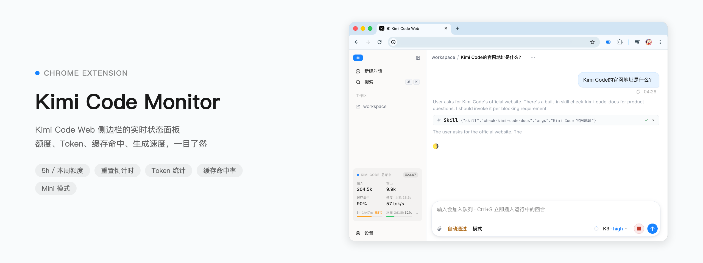
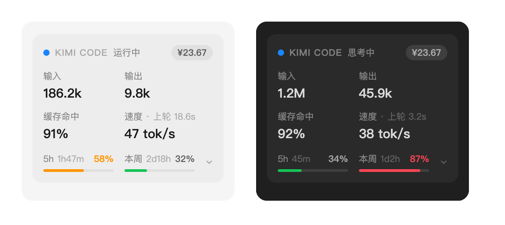
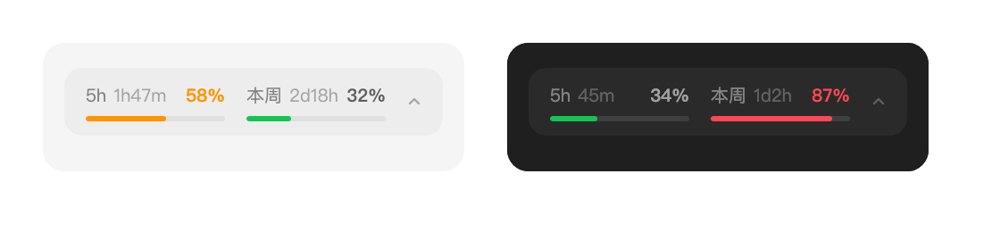
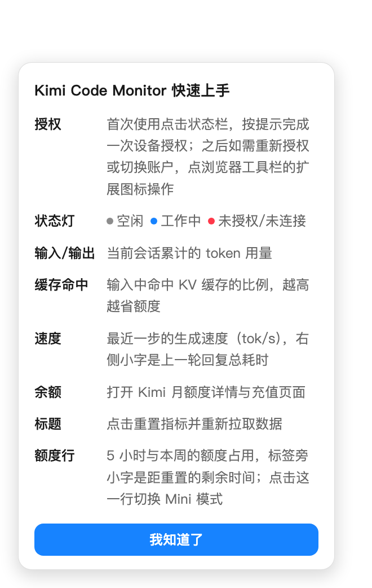
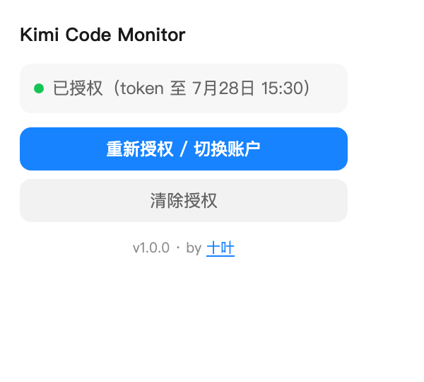

# Kimi Code Monitor

在本地 Kimi Code Web 侧边栏显示当前会话的 token、缓存命中率、生成速度、耗时、额度和加油包余额。

更多截图：Mini 模式 / 新手引导 / 授权弹窗

## 首次使用

需要 Chrome 120 或更高版本。

1. 在 `chrome://extensions` 开启开发者模式，加载本目录。
2. 打开 `kimi web` 启动的本地页面。
3. 首次加载会显示一次新手引导；状态栏显示「授权」时，点击状态栏并在 Kimi 页面完成一次设备授权。

> 注意：在 `chrome://extensions` 重新加载扩展后，Chrome 不会把 content script 重新注入已打开的页面，需要手动刷新一次 Kimi Code Web 页面，状态栏才会恢复工作。

扩展使用自己的 OAuth token，不读写 Kimi Code CLI 的凭据，避免 refresh token 轮换导致 CLI 掉线。

## 交互

- 状态灯：灰 = 空闲，蓝 = 工作中，红 = 未授权或未连接。
- 点击标题 `Kimi Code`：重置全部累计指标（含上轮耗时），重新拉取额度与会话快照。
- 点击余额：打开 Kimi 月额度详情与充值页面。
- 点击底部额度行：切换 Mini 模式（只保留额度一行，选择会被记住）。
- 额度行标签旁显示距重置的剩余时间，悬停可见精确重置时间。
- 卡片内各项数值的完整提示信息见鼠标悬停 tooltip。

## 授权管理

- 首次使用：状态栏显示「授权」时点击状态栏，在打开的 Kimi 页面完成一次设备授权；授权成功后授权页会自动关闭。
- 重新授权 / 切换账户：点击浏览器工具栏的扩展图标（或扩展详情页的「扩展程序选项」），在弹窗中操作；弹窗同时显示授权状态、版本号与作者信息。

## 架构

- `content.js`：读取本地 server credential，初始化会话用量，订阅 WebSocket 事件并更新 UI。
- `background.js`：执行 Kimi Device OAuth、自动刷新 token，并请求跨域额度 API；提供授权状态查询与重新授权入口。
- `popup.html` / `popup.js`：工具栏弹窗（兼作扩展选项页），承载重新授权、状态显示、版本与作者信息。
- `content.css`：侧边栏状态组件与新手引导样式。

WebSocket 订阅会先读取会话 `last_seq`，再只消费后续事件，避免断线重连后重复累计。

## 推荐

本扩展仅适用于 Kimi Code Web 页面；如果你想要一个更全面的、常驻菜单栏的监控面板，推荐这位大佬的作品：[KimiCodeBar](https://github.com/xifandev/KimiCodeBar)。
